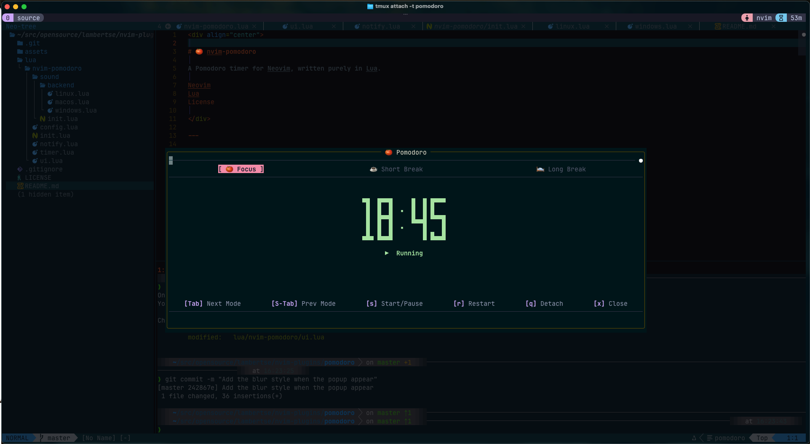
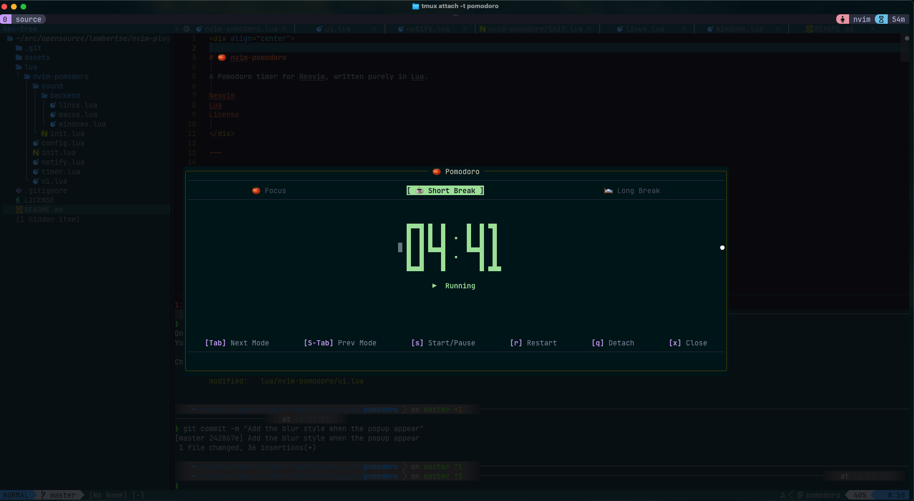

<div align="center">

# 🍅 nvim-pomodoro

**A Pomodoro timer for Neovim, written purely in Lua.**


</div>

---

## 📸 Screenshots

> **Popup — Focus session running**
> 
> 

> **Popup — Short Break**
>
> 

---

<!-- ## 🎬 Demo -->
<!---->
<!-- >  -->

---

## ✨ Features

- 🍅 **Focus / Short Break / Long Break** sessions with automatic cycling
- 🔢 **Big-digit clock** rendered in Unicode block characters, colour-animated every second
- 🎨 **Per-session tab colours** (red for Focus, green for Short Break, blue for Long Break)
- ⏸ **Pause & Resume** — pick up exactly where you left off
- 🔔 **Milestone notifications** at 5 min, 1 min and 30 s remaining (stays on screen for 8 s)
- 🪟 **Detach mode** — close the popup while the timer keeps running in the background
- ⌨️ **Keyboard-first UI** — every action reachable without leaving the home row
- 💤 **Zero dependencies** — pure Lua, uses only `vim.loop` (libuv already in Neovim)
- 🎵 Sound **optional** via `vim.notify` (works with `nvim-notify` if installed, or any custom `vim.notify` implementation) **(CURRENTLY ONLY SUPPORT MACOS)**
- ⚡ **Blurred background** (optional) to help you focus on the timer and block out distractions
---

## 📦 Installation

### [lazy.nvim](https://github.com/folke/lazy.nvim)

```lua
{
  "lambertse/nvim-pomodoro",
  config = function()
    require("nvim-pomodoro").setup({
      -- config options here, or leave empty to use defaults
    })
  end,
}
```

### [packer.nvim](https://github.com/wbthomason/packer.nvim)

```lua
use {
  "lambertse/nvim-pomodoro",
  config = function()
    require("nvim-pomodoro").setup({
      -- config options here, or leave empty to use defaults
    })
  end,
}
```

---

## ⚙️ Configuration

Call `setup()` with any overrides — all fields are optional and fall back to the defaults shown below:

```lua
require("nvim-pomodoro").setup({
  focus_time               = 25,   -- minutes
  break_time               = 5,    -- minutes
  long_break_time          = 15,   -- minutes
  cycles_before_long_break = 4,    -- focus sessions before a long break
  keymap                   = "<leader>p",
  sound = {
    enabled          = true,
    volume           = 0.7,
    backend          = "auto",
    events = {
      start     = true,
      done      = true,
      milestone = true,
      tick      = false,
      urgent    = true,  -- For the final 10 seconds of a session
    },
    files = {
      start     = "/System/Library/Sounds/Glass.aiff",
      done      = "/System/Library/Sounds/Hero.aiff",
      milestone = "/System/Library/Sounds/Tink.aiff",
      tick      = "/System/Library/Sounds/Basso.aiff",
      urgent    = "/System/Library/Sounds/Glass.aiff",
    },
  },
})
```

---

## 🖥️ Usage

| Method | Action |
|--------|--------|
| `:Pomodoro` | Open / close the Pomodoro popup |
| `<leader>p` (default) | Toggle the popup |

### Popup keymaps

| Key | Action |
|-----|--------|
| `s` | Start / Pause the current session |
| `r` | Restart the current session from the beginning |
| `<Tab>` | Cycle to the next mode (Focus → Short Break → Long Break → …) |
| `<S-Tab>` | Cycle to the previous mode |
| `1` | Switch to Focus |
| `2` | Switch to Short Break |
| `3` | Switch to Long Break |
| `q` / `<Esc>` | Detach — hide popup, timer keeps running |
| `x` | Close — hide popup **and** stop the timer |

---

## 🔔 Notifications

Automatic reminders fire once per session at:

| Time remaining | Message |
|----------------|---------|
| 5 minutes | ⏳ 5 minutes left! |
| 1 minute | ⚡ 1 minute left! |
| 30 seconds | 🔔 30 seconds left! |
| Final 10 seconds | 🚨 Time's almost up! & sound |

Works with the built-in `vim.notify` and enhanced with [nvim-notify](https://github.com/rcarriga/nvim-notify) if installed.

---

## 🏗️ Project Structure

```
nvim-pomodoro/
├── README.md
├── LICENSE
└── lua/
    └── nvim-pomodoro/
        ├── init.lua              -- Entry point: setup(), M._initialized guard,
        ├── config.lua            -- Default options, deep merge helper,
        ├── timer.lua             -- Core timer: vim.loop uv handle, start/stop/pause/resume,
        ├── notify.lua            -- Session-end notifications via vim.notify,
        ├── ui.lua                -- Floating popup, backdrop dim window,
        └── sound/
            ├── init.lua          -- Public API: sound.setup(), sound.play(), sound.toggle(),
            └── backend/
                ├── macos.lua     -- afplay via vim.loop.spawn, skip-if
```

---

## 🎨 Highlight Groups

Override any of these in your colorscheme or `init.lua`:

| Group | Default | Used for |
|-------|---------|----------|
| `PomodoroTabFocus` | red bg | Active Focus tab |
| `PomodoroTabShort` | green bg | Active Short Break tab |
| `PomodoroTabLong` | sapphire bg | Active Long Break tab |
| `PomodoroTabInactive` | muted fg | Inactive tabs |
| `PomodoroClockPulse` | cycles 7 colours | Big-digit clock (animated) |
| `PomodoroRunning` | green fg | `▶  Running` status |
| `PomorodoPaused` | peach fg | `⏸  Paused` status |
| `PomodoroHintKey` | mauve fg | `[key]` portion of hint bar |
| `PomodoroHintLabel` | overlay fg | Label portion of hint bar |
| `PomorodoDivider` | surface fg | `─` divider lines |

Example override:

```lua
vim.api.nvim_set_hl(0, "PomodoroClockPulse", { fg = "#ffffff", bold = true })
```

---

## 📋 Requirements

- Neovim **0.9+**
- A terminal with **Unicode / Nerd Font** support for block characters (`█ ▀ ▄ ▪`)

---

## 📄 License

MIT © [lambertse](https://github.com/lambertse)
